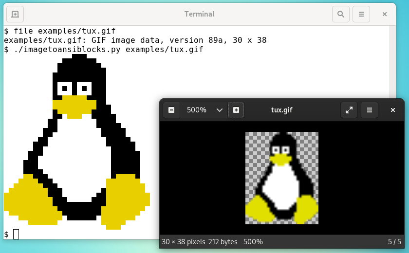

image to ansi blocks
====================

translate image pixel by pixel to ansi blocks
so that it can be displayed in terminal.

using upper half block and lower half block

https://en.wikipedia.org/wiki/Block_Elements

using foreground and background color

effectively two pixels in one ascii char

for examples see examples directory

background information
----------------------

the smallest drawing element of the terminal is a character.
a character might be a letter, a number, a symbol,
and, more recently, an emoji.

on a typical terminal every character is the same size (monospace font).
a character is about twice as high as wide.
a character has a foreground color and a background color.
for example a white letter on black background.
the foreground color is white and the background color is black.
practically all modern terminals can draw all RGB colors
for foreground and background color.

since a character is twice as high as wide we can fit two pixels
in one character.
one pixel in top half and second pixel in bottom half.
we do so using the upperhalfblock (or lowerhalfblock) character.
the upperhalfblock character has a block with foreground color at the top
and a block with background color at the bottom.
so we can assign the top half pixel color to foreground color
and the bottom half pixel color to background color.

limitations:
------------

only rgb color which may or may not be supported by your terminal.
see here for list of terminal supporting rgb:
https://gist.github.com/XVilka/8346728

terminal has no transparency.
pixels with transparency will become either total transparent or full color

this can be customized using --alphathreshold

or use --background r g b to flatten alpha values

requirements:
-------------

python3

PIL/Pillow

license:
--------

Copyright Lesmana Zimmer lesmana@gmx.de

This program is free software.
It is licensed under the GNU GPL version 3 or later.
That means you are free to use this program for any purpose;
free to study and modify this program to suit your needs;
and free to share this program or your modifications with anyone.
If you share this program or your modifications
you must grant the recipients the same freedoms.
To be more specific: you must share the source code under the same license.
For details see https://www.gnu.org/licenses/gpl-3.0.html
