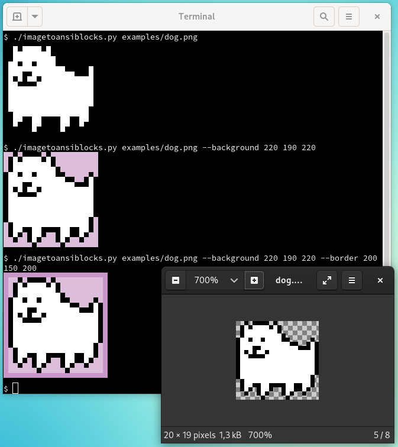
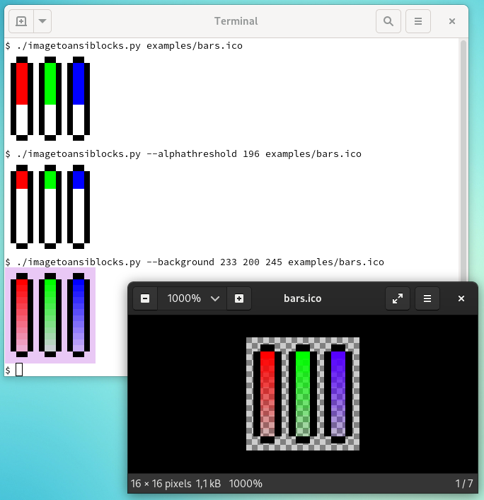

examples for image to ansi blocks
---------------------------------

tux

from https://www.reddit.com/r/linux/comments/4tiu19/i_made_a_pixelart_tux_figured_it_could_be_useful/
(the small one from the comments not the big one)

cat

from https://www.favicon.cc/?action=icon&file_id=805921

dog

dog https://www.spriters-resource.com/pc_computer/undertale/sheet/76649/

bars

bars https://www.favicon.cc/?action=icon&file_id=967040

mario https://www.favicon.cc/?action=icon&file_id=962351
