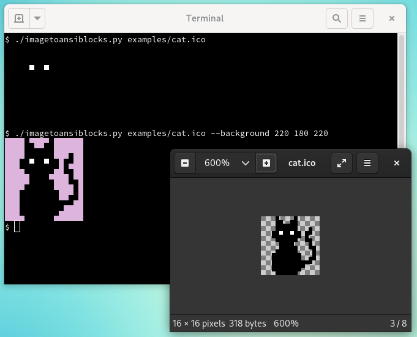

examples for image to ansi blocks

---------------------------------
tux the satisfied penguin

just sitting there.
complacent with what the project he stands for has achieved.
while maybe hopefully still dignified and humble enough
to recognize the achievement of another project represented by a gnu.

in the lower right corner is an image viewer
showing the original image of tux.
note that the image is zoomed in a couple hundred percents.
the checkered background represents transparent pixels.

----
cat

just a cat.

this time the image is drawn on a terminal with black background.
since the cat itself is black its pixels "disappear" against the background.
only the eyes remain since they are white.

the cats eyes so bright piercing through the dark.
looking straight at your soul.

i am sure the cat is understanding of all your regrets.
may you be forgiving of your own perceived faults.

with the `--background` argument you can have all transparent pixels
to be drawn in the requested background color instead.

----
mario

perhaps the most iconic 8 bit pixel ... icon.

keep going mario! the princess is certainly in the next castle. maybe.

----
catmario

also known as syobon action

one of the best mario clones out there.
besides just being a good jump and run
it is also deeply philosophical and teaches core inner values.

it tought me acceptance and perseverance.
i learned that i always may try again no matter how often i failed.
also how to count backwards to negative numbers.

----
dog

this dog is from the game undertale.
i have not played that game so i can not say anything about it.
i just liked the dog smile.

this dog is again drawn in a terminal with black background.
at first it seems just like a white dog.
but with some other background color it is visible
that the dog has a black pixel line around it.

the black pixel line disappears at the border of the image.
with `--border` you can draw a one pixel line around the image.
this will prevent a pixel line at the border to disappear
against the terminal background color.

----
bars

this image is to demonstrate the alpha handling.

since the terminal has no concept of transparency;
only foreground color and background color;
the alpha value of an image has to be flattened to 0 and 255.
with 0 means take the background color of the terminal
and 255 means take the color of the pixel.

this image has an alpha gradient from practically transparent
to fully opaque.

by default alpha is cut off at 128.
all pixels with lover alpha value is handled as if alpha is 0.
all pixels with higher alpha value is handled as if alpha is 255.

you can customize alpha threshold with `--alphathreshold`.

or you can use `--background` to have all alpha pixels
to be calculated against the requested background color.
the resulting image will have all pixels at alpha value of 255.

----
rick

rick is no stranger to love and knows the rules.
he is sure that you know too.
he is fully commited and you would not get this from any other guy.

he wants you to know that he is never going to:

* give you up
* let you down
* run around and desert you

further he is never going to:

* make you cry
* say goodbye
* tell a lie and hurt you

when rick rolls all is awesome.

----
sources

tux https://www.reddit.com/r/linux/comments/4tiu19/i_made_a_pixelart_tux_figured_it_could_be_useful/
(the small one from the comments not the big one)

cat https://www.favicon.cc/?action=icon&file_id=805921

dog https://www.spriters-resource.com/pc_computer/undertale/sheet/76649/

bars https://www.favicon.cc/?action=icon&file_id=967040

mario https://www.spriters-resource.com/nes/supermariobros/sheet/50365/

catmario/syobon https://www.spriters-resource.com/pc_computer/shobonsyobonaction/sheet/62942/

rickroll https://www.favicon.cc/?action=icon&file_id=966151
